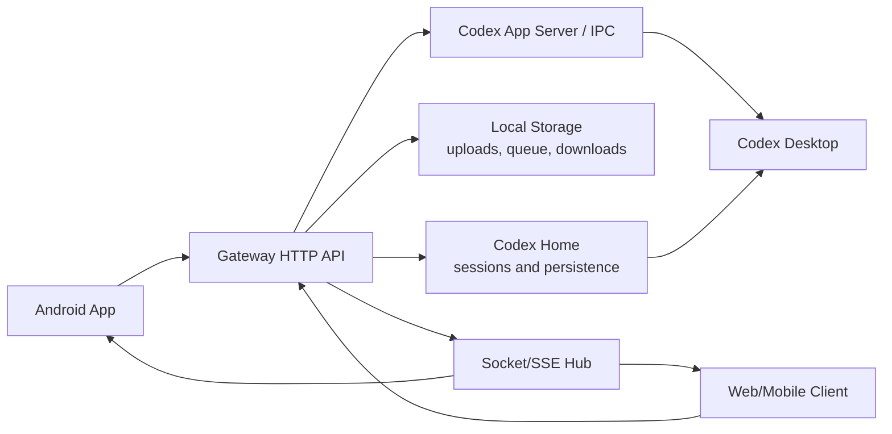

# Architecture / 架构

Codex Mobile Control uses a local Gateway as the single bridge between mobile clients and Codex data.

Codex Mobile Control 用本地 Gateway 作为手机端和 Codex 数据之间的统一桥接层。

## High-Level Flow / 总体流程



## Android App

The Android app provides:

- Login with Gateway URL and token.
- Task list, task detail, status lights, notification controls, and automation visibility.
- Composer with text, image, file, guide message, and queued message flows.
- Foreground realtime service to keep Socket/SSE updates smoother while the app is backgrounded.
- Diagnostics export with app logs and selected Gateway diagnostics.

## Gateway

The Gateway owns:

- Token authentication.
- HTTP APIs under `/api`.
- APK update files under `/downloads/latest.json` and `/downloads/latest.apk`.
- Upload storage and preview resolution.
- Gateway-side queued message persistence.
- Socket/SSE events for realtime state and message updates.
- Codex send integration through the configured send mode.

Runtime configuration is loaded from `gateway/config.json`, then environment overrides are applied.

## Codex Send Path / Codex 发送链路

Recommended mode:

```text
Android/Web -> Gateway -> official persistence / app server / IPC -> Codex data -> Desktop refresh/subscription
```

Legacy fallback:

```text
Android/Web -> Gateway -> desktop_bridge -> desktop composer automation
```

The official persistence path is preferred because it avoids relying on screen focus, lock-screen state, or desktop UI automation.

## Realtime Events / 实时事件

The Gateway emits realtime events for:

- Thread status changes.
- New or updated message content when available.
- Notification and alert state.
- Queue state changes.
- Socket health and reconnect hints.

Client behavior:

- Full message event: merge into local cache directly.
- Notification/status-only event: mark the thread as maybe updated.
- Detail screen open: show cached data first, then refresh only when the thread is marked maybe updated.

## File and Image Sending / 文件与图片发送

Files are uploaded to the Gateway first. The Gateway resolves safe local paths, stores uploads under the configured upload directory, and sends the message through the configured Codex send path.

## Update Source / 更新源

The Gateway serves `latest.json` and `latest.apk` from the configured downloads directory. Release verification checks package name, version, APK hash, and Gateway runtime identity before treating a release as valid.
